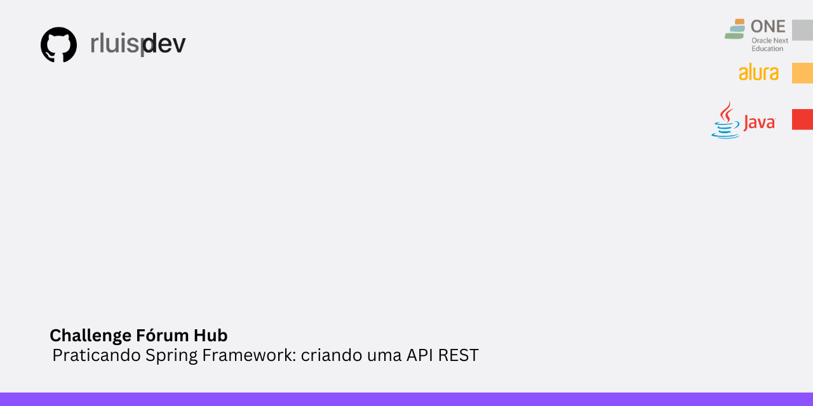

# FórumHub API
Bem-vindo à ForumHub API, uma aplicação robusta desenvolvida em Spring Boot para gerenciar tópicos em um fórum online. Esta API permite que os usuários criem, visualizem, atualizem e excluam tópicos, proporcionando uma plataforma eficiente para discussão e compartilhamento de conhecimento. Além disso, a autenticação de usuários garante que apenas usuários autorizados possam acessar e manipular os dados de forma segura.

## 🔨 Funcionalidades

 

- `Criação de Tópicos`: Permite que os usuários criem novos tópicos, fornecendo título, mensagem e outras informações relevantes.
- `Visualização de Tópicos`: Usuários podem listar e visualizar detalhes dos tópicos existentes no fórum.
- `Atualização de Tópicos` : Permite que os usuários editem os tópicos que criaram.
- `Exclusão de Tópicos`: Possibilita a remoção de tópicos indesejados ou obsoletos.

## ✔️ Técnicas e Tecnologias Utilizadas

 - Linguagem de Programação: Java 17
 - Bibliotecas : Lombok, Spring Web, Spring Boot DevTools, Spring Data JPA , Flyway Migration, MySQL Driver , Validation, Spring Security
 - IDE: IntelliJ IDEA
 - Controle de Versão: Git

   
## 💻 Como Executar o Projeto

 1. Clone este repositório:
2. Importe o projeto em sua IDE favorita (ex: IntelliJ IDEA, Eclipse, NetBeans).
3. Configure o banco de dados MySQL e atualize as informações de conexão no arquivo `application.properties`.
4. Execute a aplicação Spring Boot.

## 📈 Melhorias Futuras

- `Novo` Endpoint - /respostas
-  `Documentação` -  usando Swagger

## 👨‍💻 Student

    
    
&nbsp&nbsp&nbsprluispdev 
    &nbsp&nbsp&nbsp
    <a href="https://github.com/rluispdev">
    GitHub</a>&nbsp;|&nbsp;
     <a href="https://cursos.alura.com.br/user/rluisp"> Alura Profile</a>
&nbsp;|&nbsp;
    <a href="https://www.linkedin.com/in/rafael-luis-gonzaga-b11634186/">LinkedIn</a>
&nbsp;|&nbsp;
    <a href="https://www.instagram.com/rluispdevs?igsh=cnoxenpmaHY1amE0&utm_source=qr">
    Instagram</a>
&nbsp;|&nbsp;

  

